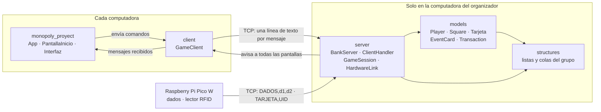
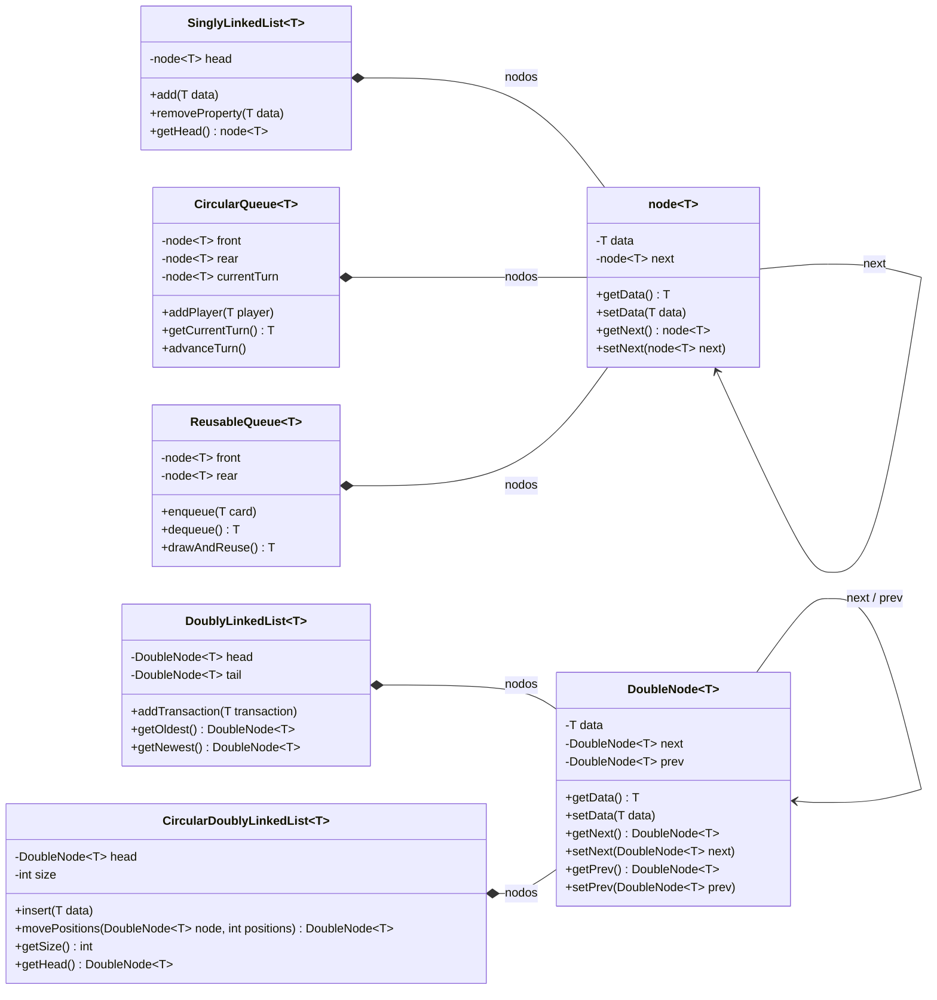
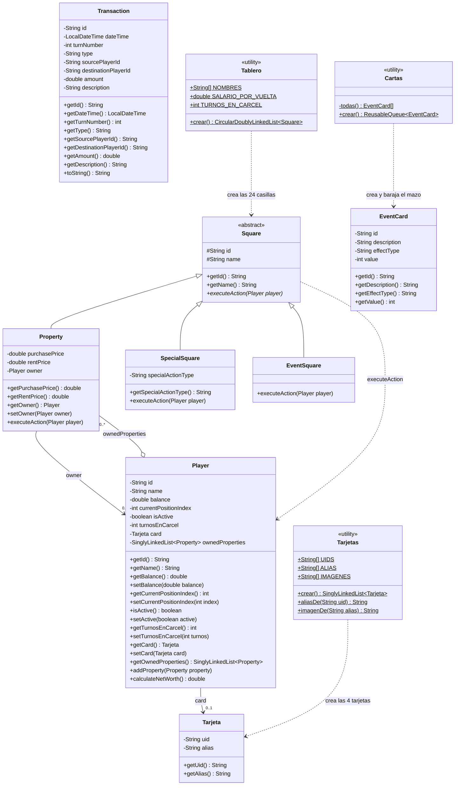
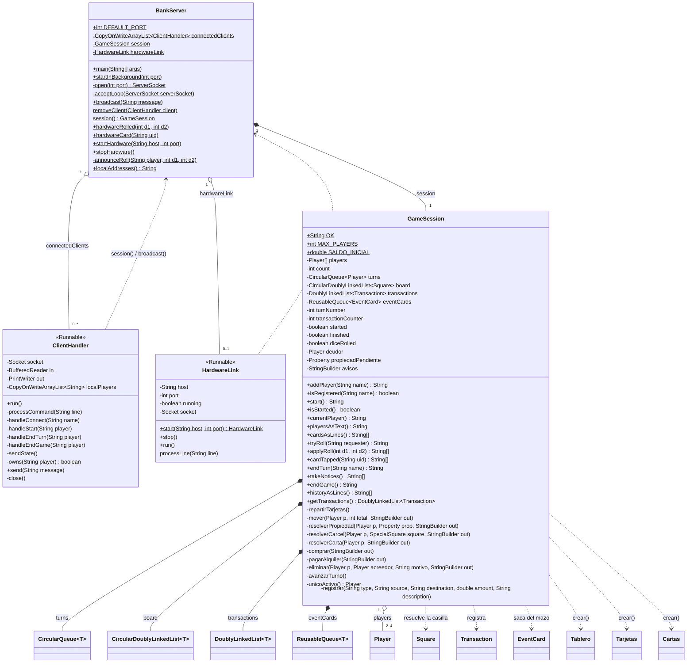
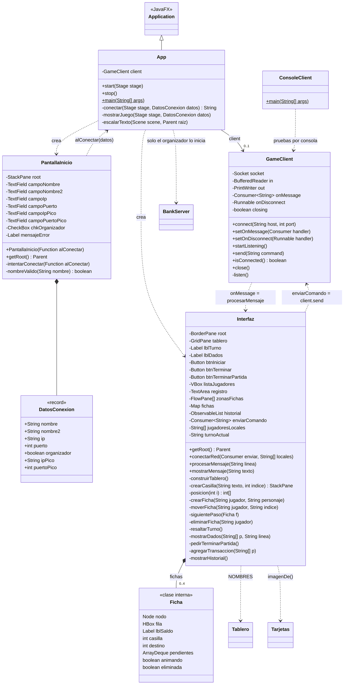
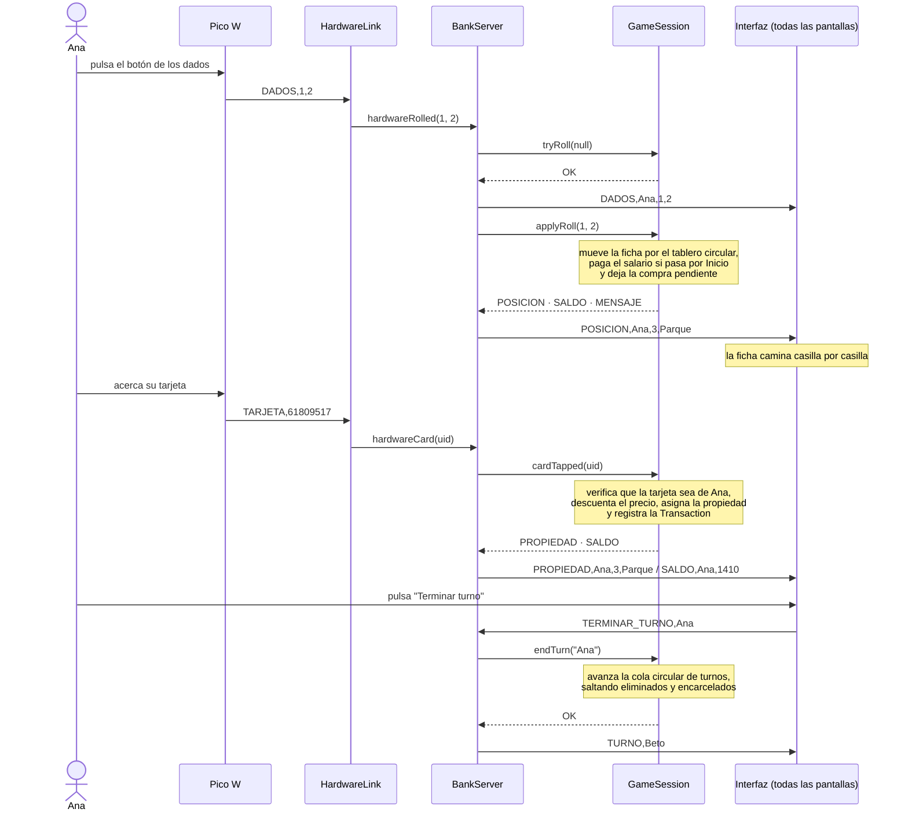

# Diagrama UML — Monopoly Chicas Superpoderosas

Diagramas de clases del proyecto, separados por paquete para que se puedan leer.
Están escritos en [Mermaid](https://mermaid.js.org/): GitHub los dibuja solo al abrir este archivo.
En VS Code hace falta la extensión *Markdown Preview Mermaid Support* para verlos en la vista previa.

**Notación**

| Símbolo | Significado |
|---|---|
| `+` / `-` / `#` | público / privado / protegido |
| `$` (subrayado) | estático |
| `*` (cursiva) | abstracto |
| `<|--` | herencia |
| `*--` | composición (la parte no existe sin el todo) |
| `o--` | agregación (el todo guarda referencias a la parte) |
| `-->` | asociación (tiene una referencia) |
| sin símbolo | visible solo dentro del paquete |
| `..>` | dependencia (lo usa, pero no lo guarda) |

---

## 1. Vista general

Cómo se relacionan los paquetes y el hardware. Cada computadora corre la misma aplicación;
la del organizador además crea el servidor (el banco) y se conecta a la Raspberry Pi Pico W.

---

## 2. Paquete `structures` — estructuras de datos propias

Las cinco estructuras del grupo y sus dos tipos de nodo. Todas son genéricas.

| Estructura | Para qué se usa en el juego |
|---|---|
| `CircularQueue<Player>` | Turnos: el último jugador apunta al primero y el turno rota sin fin. |
| `CircularDoublyLinkedList<Square>` | Tablero: 24 casillas en círculo; la ficha avanza de nodo en nodo. |
| `DoublyLinkedList<Transaction>` | Historial de transacciones, de la más antigua a la más nueva. |
| `ReusableQueue<EventCard>` | Mazo de cartas sorpresa: la carta que sale vuelve al final. |
| `SinglyLinkedList<Property>` | Propiedades de cada jugador. |
| `SinglyLinkedList<Tarjeta>` | Tarjetas RFID por repartir al iniciar la partida. |

---

## 3. Paquete `models` — los datos del juego

- **`Square`** es abstracta: cada tipo de casilla redefine `executeAction` (polimorfismo).
  - `Property`: se puede comprar y cobra alquiler.
  - `SpecialSquare`: Inicio, Cárcel, Ir a la cárcel, Estacionamiento y Banco.
  - `EventSquare`: "Carta sorpresa" y "Sorpresa"; el jugador saca una carta.
- **`Tarjeta`** solo identifica al jugador; el saldo vive en `Player`, en el servidor.
- **`Transaction.type`** puede ser `PROPERTY_PURCHASE`, `RENT_PAYMENT`, `SALARY`, `EVENT_GAIN`, `EVENT_LOSS` o `BANKRUPTCY`.
- **`EventCard.effectType`** puede ser `RECEIVE_MONEY`, `PAY_MONEY` o `MOVE_FORWARD`.

---

## 4. Paquete `server` — el banco

El servidor es el único dueño del estado oficial de la partida. `GameSession` tiene las reglas;
las otras tres clases son la comunicación.

- **`BankServer`** acepta las conexiones y reenvía los mensajes a todas las pantallas (`broadcast`). Es todo estático: hay un solo banco por partida.
- **`ClientHandler`** atiende una computadora en su propio hilo. Traduce cada línea de texto en una llamada a `GameSession`.
- **`HardwareLink`** se conecta a la Pico en otro hilo y entrega los dados y las tarjetas a `BankServer`.
- **`GameSession`** aplica las reglas. Todos sus métodos públicos son `synchronized`, porque los llaman varios hilos a la vez.

> `Bank.java` también está en este paquete, pero es una versión anterior que el servidor no usa;
> su lógica (compra, alquiler, cartas, quiebra) se trasladó a `GameSession`. Por eso no aparece en el diagrama.

---

## 5. Paquetes `client` y `monopoly_proyect` — la conexión y la pantalla

- **`App`** arranca la aplicación, muestra `PantallaInicio` y, al conectar, la cambia por `Interfaz`.
- **`Interfaz`** no conoce a `GameClient`: solo recibe una función para enviar comandos. Así la pantalla y la red quedan separadas.
- **`GameClient`** no conoce JavaFX: entrega cada mensaje a la función que le pasen. `App` la envuelve en `Platform.runLater` para dibujar en el hilo de la pantalla.
- **`Ficha`** guarda lo que la pantalla sabe de un jugador: su personaje en el tablero y su fila en la lista de jugadores.

---

## 6. Protocolo de red

Los mensajes son líneas de texto con los campos separados por coma.

**De la pantalla al servidor**

| Comando | Qué hace |
|---|---|
| `CONECTAR,jugador` | Registra un jugador en esa computadora. |
| `INICIAR,jugador` | Inicia la partida (mínimo 2 jugadores) y reparte las tarjetas. |
| `TERMINAR_TURNO,jugador` | Pasa el turno. |
| `TERMINAR_PARTIDA,jugador` | Termina la partida para todos y pide el historial. |
| `CONSULTAR_ESTADO` | Pide la lista de jugadores y el turno. |

**De la Pico al servidor**

| Mensaje | Qué significa |
|---|---|
| `HOLA,PICO` | La Pico aceptó la conexión. |
| `DADOS,d1,d2` | Resultado de los dados físicos. |
| `TARJETA,UID` | El lector RFID leyó una tarjeta. |

**Del servidor a las pantallas**

| Mensaje | Qué significa |
|---|---|
| `OK,CONECTADO,jugador` / `ERROR,codigo` | Respuesta solo para quien envió el comando. |
| `JUGADORES,a;b;c` | Lista de jugadores registrados. |
| `INICIADA,a;b;c` | La partida comenzó. |
| `TARJETA_ASIGNADA,jugador,alias` | Tarjeta (y personaje) que le tocó a cada jugador. |
| `TURNO,jugador` | De quién es el turno. |
| `DADOS,jugador,d1,d2` | Lo que sacó el jugador en turno. |
| `POSICION,jugador,indice,casilla` | A dónde llegó la ficha. |
| `SALDO,jugador,saldo` | Saldo nuevo de un jugador. |
| `PROPIEDAD,jugador,indice,casilla` | El jugador compró esa casilla. |
| `CARTA,jugador,descripcion` | Carta sorpresa que sacó el jugador. |
| `ELIMINADO,jugador` | No pudo pagar y sale del juego. |
| `GANADOR,jugador` | Solo queda un jugador. |
| `HISTORIAL_INICIO,jugador` → `TRANSACCION,...` → `HISTORIAL_FIN` | Historial de transacciones al terminar la partida. |
| `MENSAJE,texto` | Aviso informativo. |

---

## 7. Secuencia de un turno

Ejemplo: Ana cae en una propiedad libre y la compra con su tarjeta.

